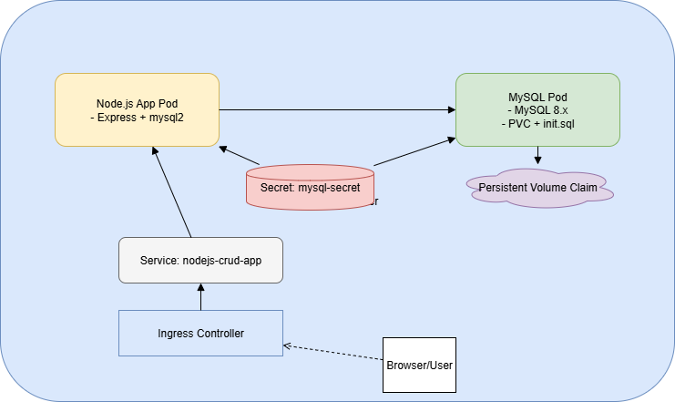

# 🛠️ Node.js + MySQL CRUD App on Kubernetes

A full-stack CRUD application built with Node.js and MySQL, deployed using Docker and Kubernetes in a Minikube environment. Designed for modularity, resilience, and observability.

---

## 🔧 Tech Stack

- **Backend**: Node.js (Express, EJS, MySQL2)
- **Database**: MySQL 8.x
- **Containerization**: Docker
- **Orchestration**: Kubernetes + Minikube
- **Ingress Routing**: NGINX Ingress Controller

---


## 🧱 Architecture Overview




- MySQL is initialized with `init.sql` (prepopulated schema + user)
- App reads DB creds from a Kubernetes `Secret` named `mysql-secret`

---

## 🚀 Setup & Deployment Instructions

### 1. **Prerequisites**
- Minikube running
- `kubectl`, `Docker`, and `kubectl ingress` enabled
- Optional: `mysql-client` or client pod access (for debugging)

### 2. **Clone & Build**
```bash
git clone https://github.com/yourusername/nodejs-mysql-crud.git
cd nodejs-mysql-crud
eval $(minikube -p minikube docker-env) 
docker build -t nodejs-crud-app:latest .
```

### 3. **Apply Kubernetes Manifests**

#### a. Deploy MySQL
```bash
kubectl apply -f k8s/mysql/mysql-secret.yaml
kubectl apply -f k8s/mysql/mysql-pvc.yaml
kubectl create configmap mysql-initdb-config --from-file=init.sql
kubectl apply -f k8s/mysql/mysql-deployment.yaml
```

#### b. Deploy App
kubectl apply -f k8s/app/app-deployment.yaml
kubectl apply -f k8s/app/app-service.yaml
kubectl apply -f k8s/app/ingress.yaml
```

#### c. Run Ingress Tunnel (Minikube)
```bash
minikube tunnel
```

Make an entry in hosts file for 127.0.0.1 using the URL shown by `kubectl get ingress`. Visit the URL in browser.


---

## 📂 Folder Structure

```
.
├── .gitignore
├── README.md
├── app
│   └── nodejs-mysql-crud
│       ├── .dockerignore
│       ├── Dockerfile
│       ├── README.md
│       ├── app.js
│       ├── config.js
│       ├── package-lock.json
│       ├── package.json
│       ├── routes
│       │   ├── index.js
│       │   └── users.js
│       └── views
│           ├── index.ejs
│           ├── layouts
│           └── user
├── docs
│   └── Minikube-Project.drawio.png
└── k8s
    ├── app
    │   ├── app-deployment.yaml
    │   ├── app-ingress.yaml
    │   └── app-service.yaml
    └── mysql
        ├── init.sql
        ├── mysql-deployment.yaml
        ├── mysql-pvc.yaml
        ├── mysql-secret.yaml
        └── mysql-service.yaml

```

---

## ✅ Task-by-Task Approach & Solutions

### Task 1: MySQL on K8s with Credentials
- Used PVC + volume mount for data and `init.sql`
- `mysql-secret.yaml` scoped to `k8s/mysql/`
- Intially created `admin` user with `mysql_native_password` uption. Finally used mysql2 and removed that option.

### Task 2: Node.js App Containerization
- Dockerized Express app with `mysql2`
- Issued commands to package using mysql2 - `npm uninstall mysql`and `npm install mysql2`
- Added `var mysql = require('mysql2');` in app.js replacing the previous entry that used mysql
- Added health probes, logs, and parameterized envs

### Task 3: App-DB Connectivity & Auth Errors
- Resolved `ER_NOT_SUPPORTED_AUTH_MODE` by migrating to `mysql2`
- Injected DB credentials via Kubernetes Secrets (used in both app and MySQL)

### Task 4: Routing with Ingress
- Defined `Ingress` to route to Node.js service
- Exposed externally using `minikube tunnel`

### Task 5: Repo Hygiene & Artifact Grouping
- Clear separation of `k8s/mysql` and `k8s/app`
- Central `README.md` for usage, architecture, and deployment
- `.dockerignore` and `.gitignore` added for build hygiene

---

## 🐛 Troubleshooting

| Issue | Solution |
|-------|----------|
| `ER_NOT_SUPPORTED_AUTH_MODE` | Use `mysql2` or specify `mysql_native_password` in `init.sql` |
| `ECONNREFUSED` to DB | Ensure PVC reset, DB pod ready before app starts |
| Ingress not reachable | Run `minikube tunnel` and check DNS mapping |
| Pod fails readiness | Check `kubectl describe pod`, probes, and logs |

---

## 🔍 Bonus Tasks Implemented

### ✅ Health Probes: Liveness & Readiness

- Configured both `livenessProbe` and `readinessProbe` in the Node.js app deployment.
- Each probe targets `/` and expects HTTP `200 OK` response.
- Helps Kubernetes:
  - Avoid routing traffic to unready pods.
  - Restart the container if the app becomes unresponsive.

```yaml
readinessProbe:
  httpGet:
    path: /
    port: 3000
  initialDelaySeconds: 5
  periodSeconds: 10

livenessProbe:
  httpGet:
    path: /
    port: 3000
  initialDelaySeconds: 15
  periodSeconds: 20
```

---

### ✅ Metrics Server & HPA Readiness

- Installed Kubernetes **Metrics Server** to enable resource metrics collection.
- Enables monitoring via:
  ```bash
  kubectl top pods
  kubectl top nodes
  ```
- Lays the foundation for Horizontal Pod Autoscaling (HPA) using CPU thresholds.

> HPA not applied yet, but metrics server is installed and cluster is ready to support it.


---


## ✨ Future Enhancements

- [ ] Helm charts for templated deployment
- [ ] CI/CD pipeline with GitHub Actions
- [ ] Kustomize to compose the manifests
- [ ] Flux CD to automate application deployment
- [ ] Monitoring using Grafana and Prometheus

---

## 📜 License

MIT © 2025 Sabari
